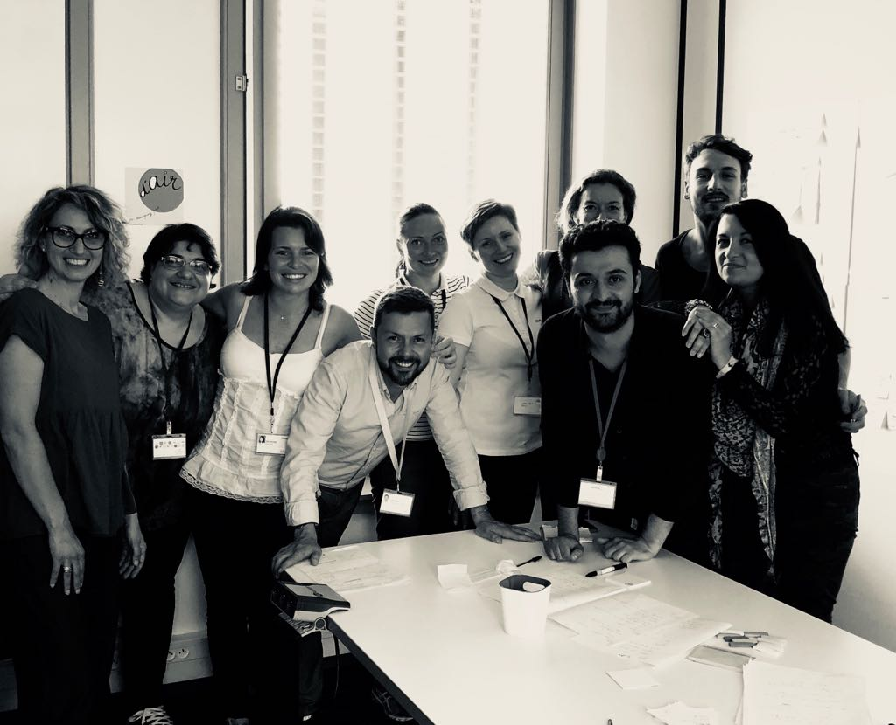

# Day 1 - Comprendre

### Plan de la journée

* Présentation des participants et du Design sprint
* Ce qu’il va se passer pendant ces 5 jours
* Ice Breaker / Hopes n Fears

> Définir l’objectif long terme, les questions du Sprint et ce à quoi nous devons répondre durant cette semaine.

> Eco-systemic map - Non réalisé, à faire en Day 2

* Ask the experts \( Emmanuelle Roux - Expert culture digital\)
* How might we notes \(durant l’interview\)
* Design fiction &gt; Long term goal 20 years projection
* Convertir l’intéressant en HMW

## Day story

Départ de sprint avec les **Hopes'n'fears**, un exercice simple pour se lancer dans l'usage des post-it mais aussi connecter les membres du groupe : en effet partager ses attentes comme ses peurs permet de détecter ce que le groupe a en commun.

Tout le monde fait remonter des attentes fermes mais également le constat que le sujet du sprint est complexe.

Nous avons en présence 2 experts externes, recrutés spécialement pour l'occasion : **la nécessité d'un expert numérique et usages ainsi qu'une anthropologue pour la connaissance des cultures et de leur mode de diffusion.**

Aussi, du côté de Adeo, les représentants de la stratégie du groupe, la partie décisionnaire projet et les points de vue des BU Zodio Italie, Leroy Merlin Brésil et Russie.

Durant la première phase, Carlos en posture de porteur de la stratégie Adeo nous présente les attentes pour le sprint : **mieux comprendre les enjeux autour de la stratégie "culture digitale" et définir des priorités d'actions terrain pour installer cette culture dans le groupe Adeo.**

#### Quelques questions majeurs remontent : 

* _Comment transformer les collaborateurs pour qu'ils soient en phase avec un monde baignant dans la "culture digitale" ?_
* _Comment partager le même niveau de culture digitale entre collaborateurs et clients ?_
* _Comment être 100 000 Collaborateurs Leaders dans un monde Phygital ?_

**Le digital change la culture humaine.** L'aire digitale porte une nouvelle culture faite de nouveaux langages et de nouveaux codes. Cependant, beaucoup de collaborateurs sont encore détachés de cette culture et ne peuvent ainsi pas en profiter. Pire, ils risquent de se retrouver "handicapés", comme dans les époques antérieures, entre ceux qui savaient lire ou non.

#### Ce que permet la culture digitale ?

* Le fonctionnement du numérique ouvre une réorganisation complète des systèmes de collaboration et de communication : notre monde n'est plus fait d'émetteurs et de gens qui reçoivent l'informations et les directives mais **tout le monde peut maintenant recevoir \(contribuer\) mais aussi émettre \(créer\)**.
* La culture numérique va bien plus loin que le digital : elle amène un fonctionnement non plus en pôle mais en éco-systèmes interconnectés, directement dans des systèmes humains physiques. **La manière dont les systèmes sont structurés online se répercutent sur les systèmes tangibles.**
* L'organisation doit s'ouvrir sur l'extérieur, intégrer tous les collaborateurs et favoriser la transparence, l'échange, le partage et la collaboration.

#### Les priorités de ADEO dans la stratégie

* les collaborateurs doivent rester "employables", c'est à dire en phase avec leur environnement qui est maintenant cette culture venant du digital
* Les dimensions à prendre en compte sont **Local / Commun / Global**
* Le **Test'n'learn** est la manière agile de cette nouvelle culture pour dynamiser les employés, autant en terme d'apprentissage que de conduite projet et leadership.
* Authentique / Impactant / Ouvert / Interdépendant sont les 4 valeurs du collaborateur.
* **Être utile pour le monde** : résoudre les problèmes des "Inhabitants".

#### Interview expert et How Might We

* Il y a une priorité sur l'apprentissage, pour que les collaborateurs puissent comprendre le numérique pour comprendre le monde de maintenant et de demain.
* La culture du numérique et ses systèmes modifient en profondeur nos systèmes humains : l'organisation des villes, la politique, etc...
* Tout est connecté : nous insérons les humains dans un système numérique totalement interconnecté.
* **Les collaborateurs ont besoins d'espaces pour essayer et échouer** : c'est le test'n'learn qui est la méthode d'apprentissage de cette nouvelle culture. 
* Se connecter à une "learning attitude" nécessaire à l'épanouissement dans un monde où tout est connecté et ouvert.
* Prendre la posture de facilitateur qui résoud les problématiques des "inhabitants".
* Chaque collaborateur peut détecter des problématiques, internes ou clients : il peut ainsi prendre la posture de facilitateur ou chef de projet, faire appel à des contributions et monter un projet autour de cette problématique. Il gagne ainsi en dynamique et leadership.
* Il est nécessaire d'avoir un système fluide dans lequel le collaborateur est plongé, lui permettant de toujours avancer dans ses projets ou de rejoindre ceux qui l'inspirent. &gt; En lien avec [la digital workplace](https://designsprint.gitbook.io/adeo-digital-workspace/).
* **La communication est en continue** : autour d'un projet, online/offline. Cette communication change les règles de la vente qui doit se faire dans le monde numérique ou physique, quelque soit le point initial de discussion.
* Ces deux mondes, online/offline sont deux champs d'expression bien différents pour une même personne. Des questions d'identités multiples ainsi que de "règles et valeurs différentes" se posent.

_Tout ceci n'est qu'une partie des idées et questions que le groupe a fait émergé. C'est une sélection suivant les réactions du groupe que le facilitateur à relevé comme remarquable pour le groupe et créant un contexte commun. Il conviendra de découvrir le lendemain la sélection réelle des priorités lors des "HMW votes"._

### Point de vue du facilitateur

La problématique "culture digitale" est énorme : elle est totalement intégrée et même génératrice des mouvements de société que toute l'humanité est en train de vivre. C'est un réel challenge que d'étudier le sujet. **Adeo est un terrain d'expérimentation idéal car la stratégie top/down est très sensible au sujet et plutôt à jour. Les collaborateurs également sont déjà dans une notion de proximité et de collaboration via leur culture très familiale qui semble toucher toutes les BUs et pays.**

Au delà de supports numériques, **c'est un réel questionnement sur la manière de collaborer, de vivre et de travailler ensemble qui se pose.** Les modèles classiques sont en train d'éclater et il faut inventer de nouveaux modèles. Dans un groupe comme Adeo, la priorité est d'embarquer tout le monde dans le même bateau et de ne laisser personne sur le bord. Cela implique de sensibiliser, former et mettre en action tous les collaborateurs, tout en respectant leur diversité et leur état culturel actuel.

Il convient de sortir du "ce n'est pas pour moi" et d'ouvrir le champ des possibles : **comment nous vivons et comment nous communiquons et créons ensemble ?** Tout le monde est impliqué dans ce questionnement, et cette implication s'exprime de bien des manières. **Adeo doit être un système structuré pour fluidifier ces évolutions grâce à une multi-culture ouverte afin de connecter autour de démarches d'émancipations communes.**

_Nous verrons dès le Day 2 les réels choix et orientations du groupe d'experts. Cette analyse reste un point de vue qui doit encore se mélanger au groupe pour faire émerger soit des axes d'actions communes, soit une meilleure compréhension de la diversité des contextes Adeo._

### Point de vue de Hugo

#### Les membres de l’équipe projet du design sprint

Une équipe multiculturelle apportant chacun son expertise : deux représentantes de la business unit Russe, la directrice de la communication d’une des marques du groupe en Italie, une responsable des magasins au Brésil et les porteurs du projet ayant la connaissance du groupe et de ses ressources humaines. Cette équipe est complétée par deux experts; un consultant dans les usages et la culture numérique et une anthropologue spécialiste des entreprises, de la consommation et de la diffusion d’une culture.

#### Sujet d’étude 

“La notion de culture digitale et sa propagation dans un groupe mondial”. Ce sujet étant extrêmement vaste, chaque personne de l’équipe projet apporte un point de vue différent pour comprendre le fonctionnement du groupe, le quotidien de chaque pays et des business unit. Enfin les experts permettent de déconstruire les préjugés autour de la culture numérique et d’apporter les bonnes pratiques, les cas d’usage. 

La première journée a pour objectif d’ouvrir le spectre des réflexions, de mieux définir ensemble le sujet et aligner nos attentes. C’est une journée pour comprendre le sujet, l’environnement et les attentes des porteurs de projet. 

Dans un premier temps, une série de présentation et de brise glace permettent de commencer à construire le lien entre les membres de l’équipe projet. 

Le facilitateur rappelle la méthode du design sprint, son déroulement et les différentes journées et étapes de la méthode. Par cette présentation simple et succinct; chacun peut se projeter dans l'avancement de la semaine et comprendre l’utilité du groupe et de la méthode. 

À l’aide d’un premier exercice individuel sur les craintes et les espoirs par rapport à la semaine, les membres de l’équipe projet positionnent leurs appréhensions concernant la direction que va prendre le sprint. Cette première étape permet de comprendre l’état d’esprit et les attentes de chacun afin de mieux aligner nos modes de pensées et notre écoute. 

Les deux représentants du groupe ont ensuite rappelé les attentes autour du sprint. L’objectif des 5 jours est de sélectionner les sujets de la culture numérique que le groupe va ensuite appliquer et tester sur les collaborateurs. Ils font donc trouver les bases communes, les éléments transversaux qui peuvent être appliqués à toutes les marques, à tous les pays et aux différentes business unit. 

Le porteur de projet a également rappelé qu’il n’y avait pas d’échec, en effet le sprint permet au groupe d’apprendre et d’acquérir des connaissances. Mieux vaut prendre 5 jours de réflexions avant de tester des solutions sur un groupe comptant 100 000 collaborateurs. 

Ce rappel est totalement en adéquation avec la philosophie du design sprint et de la culture digitale : **test and learn, il n’y a jamais d’échec que des apprentissages.** 

Les porteurs de projet ont ensuite présenté la stratégie globale concernant la transformation du groupe en entreprise plateforme. Ce document synthétique résume l’idéal du groupe et la mission qu’il s’est donné sur les 7 prochaines années. La notion centrale à retenir et le fait de faire acquérir aux 100 000 collaborateurs un leadership digital notamment sur 4 aspects : 

* **l’ouverture à son écosystème** 
* **l’authenticité dans les échanges** 
* **l’impact sur les consommateurs** 
* **l’interdépendance entre les acteurs**

De plus, une réflexion profonde sur le changement de paradigme sociétale a été mené dans la stratégie globale du groupe. **En effet, le numérique a fait émergé une société en réseau qui est à la base des nouveau comportements, des nouvelles attentes et des besoins des individus. Notre société, à l’ère du numérique, ressemble à un réseau neuronal.** Une citation tirée d’un article de Usbek & Rica résume bien ce phénomène :

_**« Il y a un couplage entre le cerveau, la forme du tissu social en réseau et les technologies de l’information. Et tout ceci nous transforme à une vitesse affolante »**_

**Cette vision doit se déployer ensuite dans plusieurs domaines du groupe notamment les ressources humaines, les produits, la data, la gestion de l’information etc.** 

**La raison d’être** du groupe a également été présenté : **comment être toujours plus utile pour l’habitat et les foyers des consommateurs ?**

D’un autre côté, les équipes RH, nous ont également partagé l’EVP \(employee value proposition\) du groupe. En effet, pour comprendre la gestion interne et les promesses du groupe aux collaborateurs, il est important de rappeler ces éléments. De plus, ils sont en adéquation avec la stratégie globale autour du numérique : 

* **Liberté d’Initiative** 
* **Épanouissement personnel et collectif** 
* **Relations professionnelles positives**

Le premier des apprentissages suite aux échanges et à la présentation de la stratégie, a été la redéfinition du sujet du sprint : 

_**“comment faire du digital une culture pour les collaborateurs”**_

Chaque membre du groupe a ensuite partagé ses réflexions et ses ressenties par rapport à la stratégie globale du groupe. Des premiers questionnements sont remontés notamment sur trois problématiques : 

* **comment faire en sorte que les dirigeants en local prennent le virage du numérique ?** 
* **comment gérer l’effacement des frontières entre monde privé et monde professionnel induit par les pratiques et le développement de la culture digitale ?** 
* **comment mettre en place les infrastructures nécessaires au développement du numérique dans les magasins ?**

Ces craintes autour de la transformation du groupe par le haut et les questions liées à l’identité à l’ère du numérique ont entraîné un partage d’expérience et de connaissance sur les pratiques actuelles au sein des marques du groupe et dans d’autres entreprises. 

**Sur la question de l’identité, le groupe a convenu que la liberté de choisir et de s’engager était la condition sine qua non à une adoption des pratiques du numérique.** En effet, les expériences menées dans certaines business unit ont montré que lorsqu’on laisse le choix aux collaborateurs d’utiliser leur mobile professionnel, ils avaient tendance à le ramener chez eux, dans leur foyer, sans que cela ne pose de problème. Une hypothèse autour des règles du jeu, a alors émergé; l’entreprise étant perçu comme un terrain de jeu, il faut donner des règles, des possibles et le choix aux collaborateurs, c’est le seul moyen pour créer une adoption massive. 

Concernant les infrastructures nécessaires à la culture numérique, il existe une grande disparité entre les pays et les différentes marques. Ce sujet semble donc être l’une des priorités.

#### Seconde partie de la première journée, grâce à la présentation de la stratégie globale 

Un premier périmètre concernant la définition de la culture numérique a émergé. Ensuite, chaque participant a été invité à imaginer le futur du groupe sur une échelle de 20 ans. 

Cet exercice de design fiction permet de construire la vision et de repérer les étapes nécessaires pour la réaliser. Cet outil de gamestorming sert à définir les bonnes questions et les problématiques nécessaires pour trouver des solutions. 

Le groupe a ensuite été scindé en deux, afin de mener une interview avec une experte de la culture digitale. Cette interview a apporté des nouveaux éléments et des nouvelles questions à ajouter à la réflexion du groupe : 

* **La nécessité de comprendre le fonctionnement du digital : par exemple de très nombreuses personnes utilisent Facebook mais peu de personnes comprennent son fonctionnement** 
* **Le besoin de penser le numérique d’une façon globale** 
* **La transformation des systèmes de formation et de l’éducation par le numérique**

D’un autre côté, le reste du groupe a commencé à imaginer les questions auxquelles il faudrait répondre pour réaliser la vision de la culture numérique. Cette technique de questionnement \(How Might We\) permet d’oublier les solutions et de se concentrer sur les causes plutôt que les conséquences. C’est un **outil principal du design thinking : se poser les bonnes questions avant de trouver des solutions.**

Cette première journée a été particulièrement dense pour les participants. En effet, il fallait récupérer un maximum d'informations et de connaissances pour nourrir les membres de l’équipe projet et les réflexions. Le champ des possibles et des réflexions permettent à l’équipe projet d’avoir une vision globale et stratégique du sujet. La seconde journée va apporter une redescente sur le concret nécessaire pour conduire le changement et transformer en actions, les réflexions issues du sprint. 

Les participants ont été aligné sur plusieurs points : 

**1/ La notion de culture à l’heure du numérique :**

* Le numérique transforme nos moyens de consommer, de communiquer et d'interagir 
* Le numérique a transformé nos manières de pensée, nos méthodes de travail 
* Le numérique a transformé la morphologie de notre société qui passe d’une société par communauté à une société en réseau

**2/ Le numérique n’est pas synonyme d’outils ou de logiciels**

**3/ Le besoin de comprendre sur le terrain le quotidien des collaborateurs**

**4/ La nécessité de remettre au coeur de l’entreprise l’humain**

### Point de vue de Fanny

L’anthropologie classique ne s’attelait initialement qu’à l’étude des cultures extra-occidentales où elle a œuvré à identifier la diversité des cultures au prisme de l’unité de l’Homme. En contexte de postmodernisme et de digitalisation des modes de vie, le recours à l’anthropologie en contexte professionnel et marchand permet d’objectiver les tensions et les opportunités que sous tendent l’intégration d’une « culture digitale » au sein d’une organisation. **Cette « nouvelle » culture du digital s’inscrit dans des fondements anciens, qui n’ont rien de moderne**. Il y a plus de 70 000 ans, Sapiens vivait sa révolution cognitive qui marqua son essor. Avec l’arrivée de l’intersubjectivité, il créa de toute pièce des entités imaginaires qui organisaient le réel : état, religion, entreprise. **La technologie, par l’intermédiaire du digital propulse notre espèce dans un nouveau rapport au monde où nos cultures se réorganisent entre globalisation des échanges et nouvelles tribalités.**

L’anthropologie permet d’objectiver les invariants culturels et/ou inconscients qui participent à créer \(ou non\) une culture pour un groupe sociologique spécifique.

D’un point de vue anthropologique, par « culture », nous entendons **« un ensemble complexe incluant les savoirs, les croyances, l’art, les mœurs, le droit, les coutumes, ainsi que toute disposition ou usage acquis par l’homme vivant en société »**. Ce concept amène certains questionnements : comment nait une culture et comment elle se transmet ? Quelle culture pour quelles identités culturelles ? Ainsi, l’objectif de l’anthropologie est d’appréhender la culture comme le fruit d’une réalité objective, échappant au contrôle des individus et opérant dans les limites de ses propres lois, de comprendre et d’analyser le déterminisme culturel à partir des expériences séparées des membres d’un groupe à un moment donné de son histoire, expériences livrant le contenu de la culture de ce groupe.

#### Partant de ce constat, comment l’anthropologie peut apporter et/ou proposer un cadre réflexif pertinent à ADEO dans le cadre de ses travaux sur la « culture digitale » ?

En appréhendant d’une part la culture et d’autre part sa diffusion par/pour/avec le digital, en comprenant qu’une culture est avant tout former d’hommes et de femmes et que le digital n’est qu’un outil de ces derniers et, enfin, que le digital transforme et conditionne l’individu dans un nouveau rapport à lui-même, à son métier et au monde qui l’entoure.

Ainsi, l’approche sciences humaines et sociales permet d’une part d’appréhender les effets de contexte au prisme de l’observation des pratiques in situ et d’autre part, d’appréhender la culture digitale chez ADEO comme un processus de diffusion d’une innovation, suivant un processus non linéaire de 3 étapes :

* L’invention ou la création d’une idée, d’un produit, d’un service ou d’une technologie nouvelle.
* Le processus social d’innovation : les tensions entre les services ou les «silos» qui n’ont pas «intérêt» au changement, aussi légitime soit-il.
* La réception par l’usager final \(salarié, entreprise cliente ou consommateur\) : la réadaptation de l’innovation en fonction des usages.

Tout en prenant en considération 10 grandes contraintes qui organisent la diffusion d’une innovation :

* **4 contraintes matérielles**
  * Le temps
  * L’espace
  * Le budget
  * Le système d’objets concrets nécessaire à la mise en place de la consommation économe
* **3 contraintes sociales et psychosociales**
  * La charge mentale liée à l’apprentissage
  * La norme de groupe : interdit, prescrit, permis
  * Les réseaux sociaux prénumériques et numériques qui diffusent la norme
* **3 contraintes symboliques**
  * L’identité personnelle ou professionnelle
  * La légitimité du changement
  * Les risques perçus

**Contexte explicité par les membres de l’entreprise :**

ADEO se positionne comme une entreprise qui évolue au même rythme que les évolutions sociétales de ses clients.

**D’un vendeur de produits, l’entreprise est en passe de devenir un vendeur de services.**

Trois phases marquantes ont structuré l’évolution actuelle de ADEO:

1.     Vendre plus avec des magasins toujours plus grand : grand choix à des prix abordables.

2.     Évolution de l’itinéraire d’achat. L’étape de l’achat dans un lieu physique est précédée par une recherche Internet.

3.     Entreprise et expérience connectée, dans un monde digital : être comme les clients, demande des clients évoluent, expérience multi device, synchronicité des attentes et des besoins.

#### Topic : toutes les BU travaillent de manière différente. Comment créer une culture, un process qui correspond à tout le monde ?

**Retours de la première journée :**

Le challenge de cette expérience vise à comprendre l’ensemble des attentes et des besoins des collaborateurs ADEO.

Le groupe témoigne de son envie d’impulser une culture digitale, mais sans savoir comment le faire.

Dès à présent, il est important de se demander quels vont être les outils de contrôle de la performance induite par l’intégration d’une culture digitale au sein d’ADEO.

**Dans cette logique, le groupe a mis en place un plan de stratégie qui vise à mettre l’homme au cœur du système, par le biais d’une approche cohérente avec les signaux faibles observables actuellement : retour à une organisation tribale et éclatée, approche disruptive de l’innovation, etc.**

A l’issue de cette première journée, on observe un écart entre la vision d’ADEO et la réalité des pratiques quotidiennes, objectivable à travers la nature des idées conceptualisées pendant les différents ateliers menés.

**Points de vigilance :**

Plusieurs points de vigilance sont à garder à l’esprit : intégration des solutions imaginées durant ce sprint dans une réalité qui correspond aux aspirations des collaborateurs, prise en considération de la réalité des contraintes quotidiennes des vendeurs, objectivation des signaux faibles sociétaux qui vont tendre à se développer.

Attention à ne pas tomber dans la mise en place d’une « boite à outils » au service de la performance d’entreprise, qui d’une part de met pas l’homme au cœur du système et qui d’autre part positionne le collaborateur en potentielle situation d’échec \(manque de connaissances et de compétences, outils non adapté aux différentes strat hiérarchique de l’entreprise, etc…\). Cf. Lean management.

L’atelier design fiction n’a pas forcément été bien compris et bien exploité par le groupe. La transition entre cet exercice et la transformation des idées en questions majeures n’a pas été fluide.

Manque de capitalisation du groupe sur les données récoltées pendant l’entretien téléphonique avec l’expert.

**Pistes à développer :**

La création d’une culture « digitale » d’ADEO passe par la création de réseaux différenciés qui visent à améliorer la relation clients tout comme le bien-être de ses salariés. Changer d’échelle d’observation tout en imaginant un nouveau mode de construction de la réalité \(par exemple échelle du foyer, plutôt que du magasin\).

Différents éléments semblent rentrer en considération pour les individus du sprint et vont être constitutifs du modèle de culture qui va être mis en place : morale \(droit à la déconnexion\), éthique \(RSE\), performance \(générer du CA\), sociétal \(accompagner les individus dans un mieux-vivre\). La question que l’on peut alors se poser est : **comment rendre compatible une approche philosophique de la culture digitale au sein d’ADEO avec une utilité terrain au quotidien ?**

### Interview de Emmanuelle Roux

Quelques pistes de compréhension en plus par une "exeperte" de la culture digitale.

Le point principale de cette culture est le partage et faire ensemble. Cependant actuellement, le numérique est hostile pour 90% de la population, qui le subit plus qu'elle n'en profite.

Elle a alors monté "le chaudron" pour gérer la mutation des métiers. Elle propose aussi de l'apprentisage et remettant des "flocons du numérique".

**La culture devient l'environnement** dans lequel s'exprime des acteurs.

Toute ces évolutions viennent du TCPIP et de la logique emetteur/recepteur. Les humains deviennent eux aussi E/R contrairemetn à avant dans l'histoire, il n'y avait que des R ou des E.

Elle postule même que "nous sommes en train d'ajouter de humains dans les réseaux de machines." Pour cette raison qu'il faut rendre capable les collaborateurs grace à la "digitale workplace". Il faut lui donner du pouvoir, lui permettre d'agir. Comment est-ce qu'il peut faciliter la collaboration e têtre leader des proejts collaboratifs ?

Cette culture numérique va jusqu'à modifier l'organisation de nos villes, la gouvernance de nos sociétés. Cependant encore 90% des humains sont "illettrés" du numérique. Il leur faut comprendre la complexité.

Le Smartphone est le foyer numérique, tout est simple, totu le monde utilise. Cependant, peu savent comment ça marche. Ce qui est le côté "illettrés" qu'il faut régler pour redonner du sens pour tous.

Dans les entreprises, la DSI s'apparente à un service de traduction, mai strop de demandes. Il faut donner aux gens le pouvoir "d'écrire", de créer numériquement.

#### Priorités selon elle

> Comment on vit et comment on communique ensemble ?

* 1. Donner du sens. Prendre conscience de l'impact du numérique. Sortir de "c'est pas pour moi".
  2. Mettre en place un système d'éducation par niveau d'expérience + Test and learn + être explorateur, se fédérer.
  3. 100% d'espaces pour apprendre.

**J'ajouterais à ces retours, 100% d'espaces pour apprendre en contexte de ses actions quotidiennes. Ne plus segmenter apprendre et agir, être dans une boucle de test and learn continue.**

