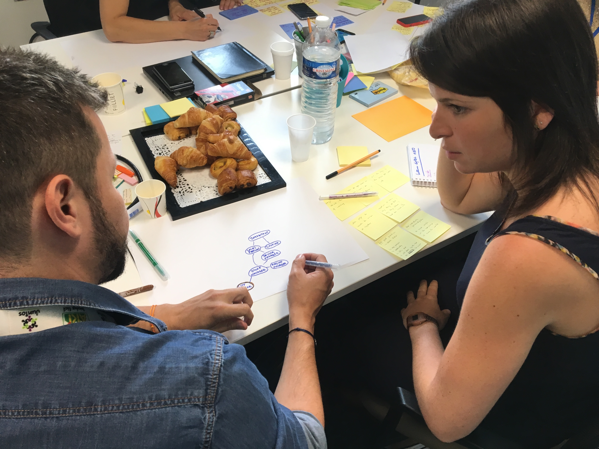

# Day 2 - Diverger

Plan de la journée

* Define the group big challenge
* Eco-systemic map - Flux and diversity
* HMW - Vote 4/5 dots
* Place on the map
* **Define Target and Cible**
* Lightning demos and research feedback
* Collect priorities for personal use
* Connect to create ideas and structure project

_Suite aux retours de la première journée, et aux détections des priorités, voici la formulation utilisée par le groupe pour le Big Challenge._ 

### **How can Adeo be a 100 000 leaders team in a "Phygital culture" world ?**

Cette formulation prend en compte la priorité d'Adeo d'impliquer tous les collaborateurs et de les accompagner pour développer leurs valeurs : **Authentique / Impactant / Ouvert / Interdépendant.** Il faut également prendre en compte l'environnement influencé par la culture digitale qui impacte une culture humaine en constante évolution.

#### Eco-systemic map

Ce sprint est l'occasion de sortir de ma zone de comfort : la méthode Sprint invite à construire l'user map ou l'user journey : **cependant dans notre cas d'étude, ce n'est pas un parcours à prendre en compte spécifiquement mais plutôt un système.**

Pour construire au mieux un système, il convient de le faire reposer sur des éléments qui ne changeront pas. Ici, suivant la vision d'Adeo qui se veut être "usefull for the world", par le spectre de l'habitat et du foyer, il semble principal de **mettre au centre "l'inhabitant".** Comme vu la veille, Adeo veut être customer-centric. Ce que nous proposons ici avec ce système est d'être **Inhabitant- centric**, plus précis que human-centric et moins orienté commercial qu'en utilisant le concept de "customer" initial.

Des groupes de 2 et 3 partent donc de "l'inhabitant" au centre pour construire leurs systèmes. La consigne est de construire le système actuel Adeo connu, pour le faire évoluer d'aujourd'hui vers son futur. Un groupe cependant construit 2 systèmes, reposant sur le présent et un futur imaginé. Aucune consigne spécifique : l'idée est d'utiliser des cercles pour des concepts "humains" ou des projets et de les intégrer dans d'autres cercles "groupes"; ensuite il faut relier  ces concepts pour créer les liens d'interactions. Ces derniers peuvent être online ou offline, la différenciation des liens et des échanges dans le système n'est pas importante à cette étape..

Tous les groupes réussissent sans soucis à construire leur système dans lesquels ils testent des scénarios imaginaires pour valider leur structure. Il semble que ce soit un exercice très stimulant et sans friction ce qui est encourageant : en effet, prendre conscience d'un système est de prime abord complexe, mais **grâce à un exercice ouvert qui n' impose pas la manière de faire, les participants ont réussi à apporter de la diversité dans les points de vue du système.** 

Chacun ayant son système, nous regroupons les différents points de vue avec une présentation. Les feedbacks sont légers malgré les différences de formes entre les systèmes. **Nous remarquons qu'ils sont complémentaires et que la diversité des systèmes permet à chaque membre de se créer une représentation plus complète du système global**, je dirais même une conscience du système global Adeo, sans nécessité d'utiliser des techniques plus complexes comme une représentation 3D ou 4D...

En utilisant les gommettes, nous ajoutons de l'information sur ces systèmes : 2 rouges et 2 vertes par participant. Les rouges pour les relations entre les acteurs ayant des frictions importantes et les vertes pour les relations fluides. Cela permet de rajouter des interprétations qui vont nous aider à détecter des axes prioritaires d'actions grâce à une représentation systémique.

#### HMW - Vote 4/5 dots

Suite à cette structuration systémique, nous revenons sur les HMW. En effet, ce travail à fait émergé de nouvelles questions, que nous avons ajouté sur la board HMW. Il est temps maintenant de regrouper par thème et de voter pour définir les priorités. Le groupe doit converger sur les questions à explorer plus en détail. 4/5 dots pour chaque participant.

**Les questions majeurs retenus**

* How to build a way - Seller in store TO selling online ?
* How can i reinvent my job and my relation with the inhabitant ?
* How might we mesure the efficiency \(KPI - Feedback\) ?
* How to show the level of progress on digital culture in Adeo ?
* How we can stimulate test and learn in store ?

Le groupe fait remonter le fait que ces questions sont proches : **Elles se situent autour de la relation client - employé terrain.** En effet, s'il est possible d'améliorer le "lien" entre inhabitant et store seller, **cela lance une dynamique qu'il sera possible ensuite de mesurer pour en qualifier l'évolution d'un point de vue culturel.** Tout ceci n'est pour le moment que des inspirations, des axes, mais le groupe semble aller dans un sens commun.

#### **Le target et cible**

Que ce soit d'un point de vue systémique où des HMW questions, le coeur d'action à prioriser est **le lien "inhabitant - seller"**. C'est cette connexion essentielle du point de vue vision Adeo comme d'un point de vue économique qui sera le coeur d'action. Les cibles concernées sont désignées : le seller et l'inhabitant, inévitablement liés. Tout le reste du système pourra ensuite nourrir cette relation, suivant les idées des projets de chacun.

_Par rapport à la structure classique d'un sprint, plusieurs ajustements sont présents : il nécessitait plus de temps en première journée pour l'exploration et nous ne validons le target qu'en début d'après-midi. Également, pas d'user map, une représentation en système semblait plus pertinente qu'un parcours : **lorsque l'on parle culture, c'est plus judicieux de travailler sur des espaces plus en largeur que sur un parcours linéaire.**_

#### Collect priorities for personal use

De manière à préparer la construction du projet individuel de chacun, les différents intervenants de Adeo présentent les actions déjà en cours au sein du groupe. Nous découvrons beaucoup d'explorations "digital-centric" avec quelques intégrations en terme de culture mais rien de totalement dans notre spectre. Nous en notons cependant les différentes inspirations comme la gammification pour créer une dynamique.

Egalement, à 10h pour commencer la journée, nous avons appelé Frédéric, un expert transition human-centric des entreprises et interne au sein du groupe SEB. Il nous apporte toute une inspiration sur ses actions depuis plusieurs années : structurer un système ou le collaborateur peut "devenir qui il veut", comprendre "pourquoi" changer ses manières de faire, comment résoudre les problématiques de son quotidien en collaboration, comment partager la connaissance et co-construire une base commune continue. **Un peu à la manière des développeurs avec GitHub**, co-construire en continue au fil des problématiques traitées. Utiliser les codes du digital pour faire évoluer des systèmes humains et physiques. Aujourd'hui, l'open source pour construire des plateformes comme Wordpress. **Demain, l'open source pour construire nos systèmes humains, nos projets, nos villes, nos politiques, nos cultures...**

La plateforme numérique reprend sa place "outil" en support des actions humaines. L'usage est adapté au niveau de la "culture numérique" : un collaborateur non-initié pourra participer en prenant simplement des photos pour créer des "issues" sur des sujets particuliers et ainsi participer à faire évoluer la connaissance globale de tous, en faisant évoluer les protocoles à disposition sur la plateforme, structurés par des collaborateurs plus expérimentés. **Pas de standard, les pratiques sont ouvertes et évolutives. Tous les collaborateurs sont contributeurs.**

#### Collect priorities for personal use / Connect to create ideas and structure project

Il est temps de se lancer dans les projets individuels, suivant la méthode des "4 steps sketch". Chaque participant regroupe sur une feuille blanche tous les "ingrédients" pour construire sa recette : si l'on devait détruire toute la base de connaissances construite par le groupe, qu'est-ce qu'il faudrait absolument garder, au regard de l'objectif du sprint, du target et des cibles ?

Suite à ce regroupement, chaque membre du groupe commence à construire son propre système d'idées, la base nécessaire à son projet.

Dans un contexte de sprint normal, la journée se termine avec le projet finalisé. Dans notre situation, nous avons utilisé beaucoup d'énergie dans la représentation des systèmes. Je décide alors d'arrêter ce Day 2 en récupérant les systèmes de projets de chacun : demain commencera avec le Crazy 8" dont personne ne sait encore rien. Il est intéressant de conserver des surprises dans le sprint : c'est aussi un moment de jeu constructif :\)

### Point de vue du facilitateur

Suite à quelques recherches, je partage au groupe un outil très utile pour notre sujet : 

* Nous partons d'une culture Adeo actuelle. 
* Notre travail et de designer des solutions à pousser en test. 
* Ces solutions ont pour objectif de répondre à des besoins. 
* Ces besoins, ces désirs humains deviennent s'ils sont accessibles de manière fluide des éléments de la nouvelle culture Adeo.

**Chaque design qui fonctionne s'impreigne dans la culture, par exemple :**

_Intégrer une caméra frontale au smartphone &gt; Répondre au besoin de se prendre soi-même en photo &gt; devient un élément de culture comme le SELFIE._

Chaque création implique donc une intégration dans une culture. Ainsi, il convient de bien réfléchir ses actions pour imprégner de manière durable une "culture digitale" partagée.

Il est primoridal selon moi, et suite aux éléments apportés depuis 2 jours, de bien valoriser le fait que **la culture digitale n'implique pas forcément le digital au centre.** C'est les éléments humains qui sont à valoriser : la collaboration, l'expérimentation, le test'n'learn, le partage de connaissances, les bases communes de connaissances et de protocoles accessible à tous et modifiables par tous. À la manière des développeurs, qui ont structuré leurs collaborations online, nous pouvons maintenant structurer nos collaborations offline : un système fluidifié, ouvert et participatif. Un culture co-construire et en constante évolution, spécifique à chaque éco-système en interdépendance.

**Je suis agréablement surpris de la réussite apparente des Eco-systemic map** : c'était clairement une proposition expérimentale imaginée la veille. J'ai pris clairement un virage par rapport au processus original du sprint qui n'est à la base pas adapté pour une problématique aussi large et systémique. En dehors de ma zone de confort j'ai choisi d'embarquer le groupe en exploration avec moi et le groupe a suivi et très bien réagis. **Cependant, je conserve le coeur essentiel du sprint** : l'alternance entre diverger et converger, individuel et collectif, macro et micro, intellect et intuition, concepts abstrait et actions concrètes. Il faut dans tous les cas avancer le long d'un timing structuré pour concrétiser et éviter ainsi les frustrations d'un monde intellectuel qui n'aboutit pas. **Intégrer également les attentes des participants, le contexte professionnel et les éléments qu'ils vont acquérir personnellement en sortie de sprint... Cela fait beaucoup de paramètres mais c'est un tout cohérent qui se ressent presque plus qu'il ne se réfléchit.**

### Point de vue de Hugo

Grâce aux réflexions du groupe en jour 1 sur les enjeux, les tenants et les aboutissants de la culture numérique, le jour 2 nous permet de partager un maximum d’informations et de connaissance sur ces sujets : à l’aide d’expérience testés en local dans les business unit, de retours d’expérience des experts et des projets en cours dans le groupe… De même, cette journée va servir à visualiser le fonctionnement du groupe. 

Pour se faire, il faut construire **une cartographie des échanges et des interactions qu’ils se passent dans le système de l’entreprise.** Afin d’apporter de la diversité mais également de la cohérence, le choix a été fait de se concentrer sur **la relation entre les vendeurs en magasin et les consommateurs**, tout en laissant le choix au binôme de choisir le niveau de représentation du système : plus ou moins macro ou micro. 

Cet exercice de construction d’un système est un excellent outil de synthèse pour repérer les liens et les interactions entre les différents agents et acteurs. 

D’un autre côté, il permet également de repérer les frictions et les relations efficaces d’un système. C’est un outil de simplification de la réalité qui est utile pour permettre aux participants de pouvoir penser et envisager la complexité du groupe. 

Les systèmes ont permis à l’équipe projet de se projeter dans la complexité du groupe. Certains mapping se sont concentrés sur l’ensemble des interactions autour de la relation vendeur - consommateur : logistique, infrastructure, managers régionaux. D’autres binômes ont fait le choix de se concentrer sur l’expérience du consommateur et les points de contacts avec les magasins. 

Il en est ressorti plusieurs points : 

* **La nécessité d’améliorer l’infrastructure technique \(wifi, BYOD, formation\)** 
* **L’importance de réinventer la relation vendeur - consommateur** 
* **Le développement des relations entre les magasins et des ambassadeurs à l’extérieur en local** 
* **Les problématiques entre les fournisseurs et les magasins.**

Ces mappings ont permis également de générer des nouvelles questions \(How Might We\) qui vont permettre de donner des nouvelles directions. 

Dans un second temps, les membres des business unit et les responsable RH du groupe ont partagé les réalisations actuelles en terme de culture digital afin de nourrir en inspiration les membres du groupe. 

Plusieurs bonnes pratiques sont ressorties de ce benchmark : 

* **Le développement d’application mobile au coeur des magasins afin de développer l’autonomie des vendeurs et d'optimiser la relation client à travers des échanges, du partage de connaissances et des conversations** 
* **L’importance de la prise en compte des savoir-être et des compétences en social media dans le recrutement d’une partie des nouveaux collaborateurs** 
* **L’utilité de la gamification pour conduire le changement, former les collaborateurs et comprendre un sujet** 
* **La nécessité d’acculturer les managers, les dirigeants du groupe à l’aide de la prospective à travers des conférences thématiques : la famille 2.0, le futur de l’éducation à l’heure du digital etc**

Dans un second temps, les membres de l’équipe projet ont été amené à sélectionner les questions le plus importantes afin de sélectionner le ou les sujets sur lesquelles le groupe devait se concentrer et apporter un début de solution. Grâce à un vote individuel et à un rapprochement entre les questions, le choix a été fait de se concentrer :

* **La transformation du vendeur en vendeur digital culture** 
* **Les mutations des métiers en magasin** 
* **L’amélioration de l’infrastructure digitale** 
* **La mesure de la transformation numérique du groupe**

Ces 4 sujets forment un tout sur lequel le groupe va plancher afin de proposer des projets et des solutions pour répondre aux objectifs du sprint.

Enfin pour terminer cette seconde journée, les membres de l’équipe projet ont dû rassembler les éléments issus du jour 1 et du jour 2 qui allait leur servir à construire leur futur projet individuel. En utilisant l’ensemble de l’intelligence partagé par le groupe, les membres de l'équipe projet peuvent commencer à imaginer une solution. Pour construire leur projet, les membres doivent créer les connexions nécessaires entre les différents éléments qu’ils ont sélectionné : les questions HMW, les éléments des benchmarks, les éléments de la vision de l’entreprise, les définitions autour de la culture et du numérique etc

### Point de vue de Fanny

D’un point de vue anthropologique, la deuxième journée de l’expérience reprend 3 notions essentielles qui vont structurer le reste de la démarche :

1.     Échanges d’expériences et de bonnes pratiques.

2.     Conceptualisation systémique du modèle organisationnel d’ADEO.

3.     Objectivation de la place et de la relation individu/digital dans une culture d’entreprise.

La journée a débuté par une téléconférence avec Frédéric Goncalves, responsable de l’excellence opérationnelle \(industrie et hors industrie\) du Groupe SEB. Ce dernier explique le principe de la démarche OPS qu’il a déployé au sein de son entreprise et comment et pourquoi mettre « l’Homme au cœur du système ». Son témoignage apporte un éclairage intéressant sur plusieurs points :

-       Importance d’engager et de co-construire la démarche avec les collaborateurs : mise en place de pilotes de proximité OPS, implication des collaborateurs, partage d’expériences, amélioration continue \(individuelle comme collective\).

-       Importance de mettre en place de nouveaux outils de contrôle de la performance afin d’agir sur des leviers humains pour atteindre plus de productivité et non l’inverse.

-       Importance de capitaliser sur l’ensemble des théories managériales existantes afin de s’en émanciper et de recentrer l’approche sur la dimension humaine et non productive.

-       Importance de capitaliser sur les savoirs techniques et les outils digitaux afin d’accompagner au mieux les équipes : la technologie est un moyen d’atteindre un objectif et non une fin ou un partie prie de départ.

-       Importance de créer des temps de team building afin de fédérer les différentes équipes du programme.

-       Nécessité de créer un  « univers » ou une « culture OPS » afin de fédérer les individus.

-       Nécessité de se réinventer continuellement afin de faire coïncider les valeurs et la réalité du terrain : atelier de co-construction mené en interne et avec les collaborateurs des sites \(Cf. Test&learn\).

Au-delà des facteurs clefs de réussite que FG nous énumère, un certain nombre de difficultés sont citées directement ou de manière sous-jacentes à ce retour d’expérience :

-       Difficulté d’embarquer tous les collaborateurs dans la démarche.

-       Lever les freins au changement : une nouvelle manière d’aborder la productivité et le capital humain n’est pas forcément aisément compris et accepté par tous les collaborateurs.

-       Travailler dans la durée : alternance entre des phases théoriques, de réadaptation et à nouveau de test.

-       Bonne adéquation entre les attentes politiques, intellectuelles, éthiques et la réalité quotidienne du terrain pour les collaborateurs.

-       Mise en place d’outils ou de processus qui soient bénéfiques à la fois pour le collaborateur comme pour son équipe ou pour la structure en générale.

-       Prise en considération non pas seulement des savoirs métier et/ou des fiches de poste mais bien de la réalité objective des pratiques des collaborateurs et de leurs contraintes informelles.

-       Appréhension des différences de niveaux et de compréhension en fonction des dispositifs proposés pour mettre « l’Homme au cœur du système ».

Ainsi, FG nous a permis de mettre en tension deux notions, celle de « l’homme » et celle du « système ». Ces deux notions, loin d’être antinomiques participent à appréhender le sujet de la « culture digitale » dans un ensemble fait avant tout d’acteurs.

De ce fait, cette seconde journée a permis de faire émerger par équipe des cartes systémiques qui modélisaient leurs réalités du fonctionnement d’ADEO et des différentes marques du groupe. « L’inhabitant » fut au centre de chaque système organisé. Cette modélisation de la réalité permet d’une part de faire prendre conscience de la subjectivité des représentations que chaque collaborateur a de sa structure, mettant en tension les éléments jugés importants \(car figurants sur le dessin\) et, à l’inverse, des éléments qu’ils avaient omis, mais qui ont pourtant leur importance dans l’organisation globale.

La confrontation des modèles au sein des différentes équipes permet de mettre en exergue l’écart entre la perception individuelle et collective d’une structure.

Cet exercice qui appelle à la réflexivité amène chaque collaborateur de l’expérience à s’interroger sur la typologie de liens et les relations qui existent entre chaque acteur d’ADEO.

La mise au centre de « l’inhabitant » permet de situer l’approche culturelle d’ADEO, non seulement centrée client, mais surtout centrée humain. Cette orientation appelle à réinterroger la relation entre l’individu et le digital au sein des points de vente. En effet, si le point de départ de la réflexion s’articule autour du « client », il convient non pas de penser un dispositif digital descendant \(imaginé par ADEO et proposé aux « vendeurs »\), mais bel et bien un dispositif ascendant ; c’est à dire une solution qui prend en considération non seulement les aspirations des « clients », mais également les enjeux et les contraintes des collaborateurs en lien avec ces fameux « clients ».

Ainsi, le digital tend à s’organiser comme un support et participant à la fluidification de l’expérience proposer « in store » aux collaborateurs, comme aux clients.

