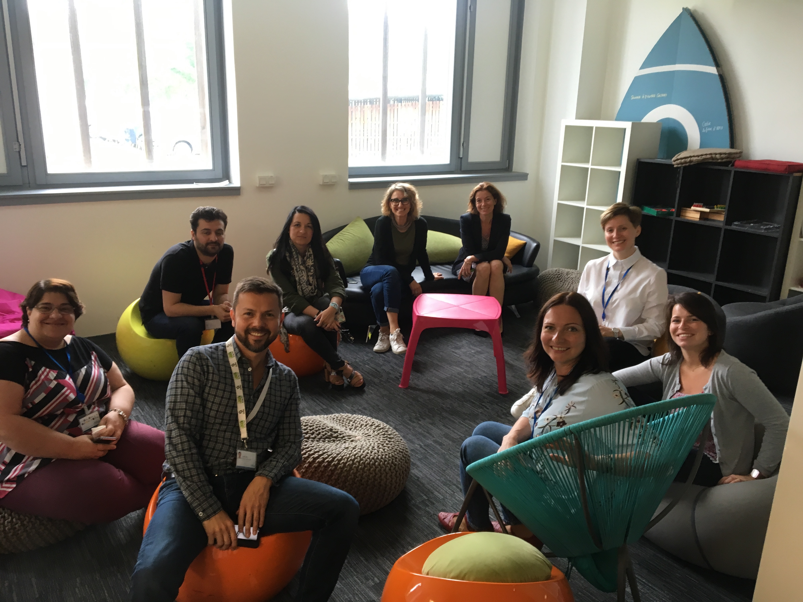
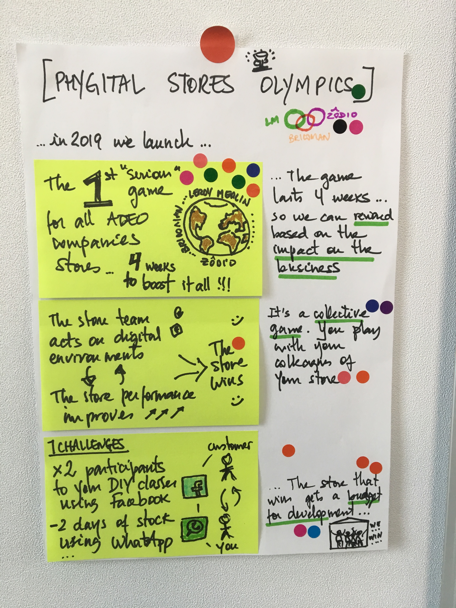
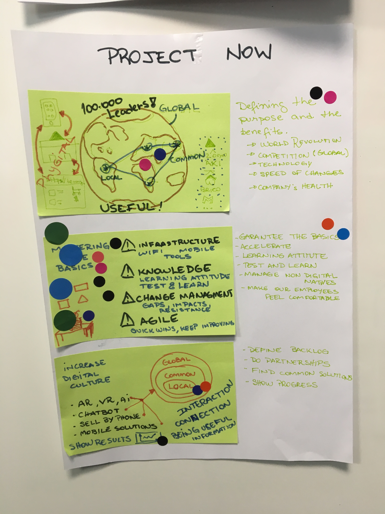
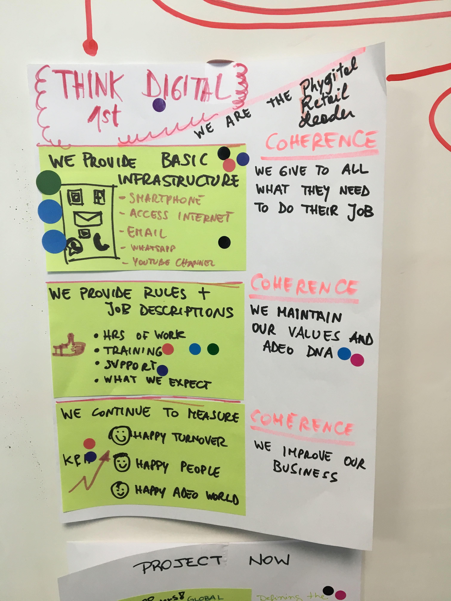
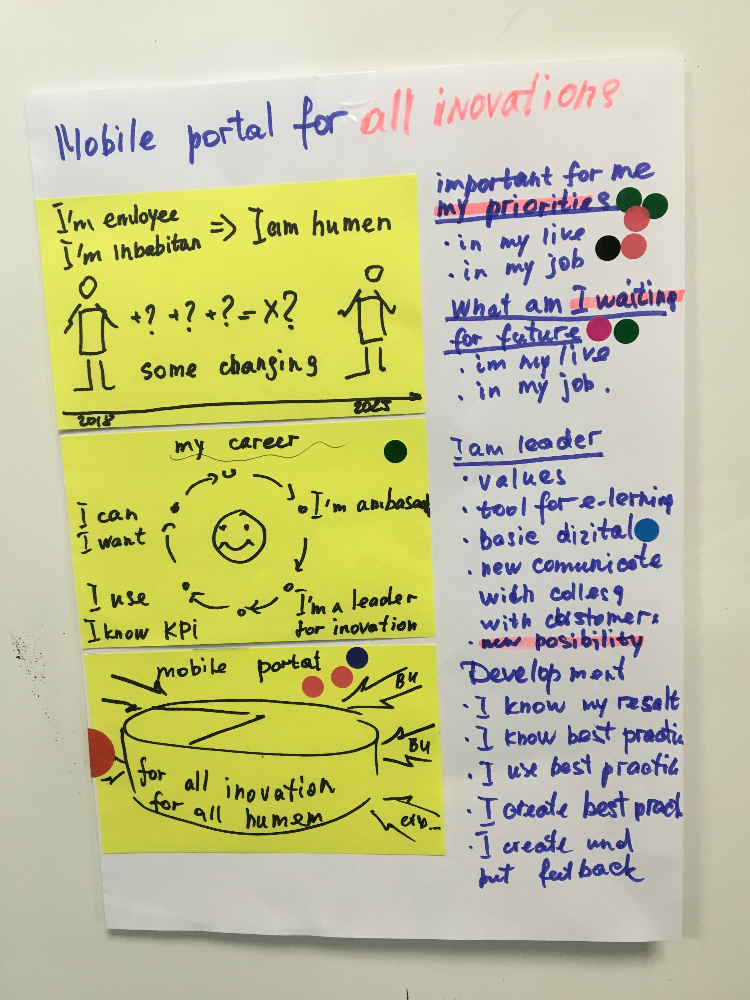

# Day 3 - Converger

### Plan de la journée

* Get crazy
* Structure projects
* Museum discovery
* Hit map and reveal
* Big vote
* Decider vote
* Merge or divise
* Storyboarding

La journée commence par le crazy'8 qui surprend et démarre cette journée avec énergie ! Toujours difficile d'appréhender le "4 steps sketch" coupé par le milieu : en effet, c'est un processus qui demande aux participants de rentrer dans un "flow" créatif, le fait de couper risque de rompre le fil... Heureusement la veille, tout le monde a fini son système et ses connexions, ce qui est la base pour construire le projet qui n'est plus pour soi mais pour les autres. J'ai aussi bien précisé de ne plus ajouter d'autres éléments : en effet, il est temps maintenant de converger !

Suite à la fin des conceptions projet, une pause de 30 minutes, que nous avons passé à découvrir le QG du groupe, permet de décrocher avant de découvrir la présentation, en mode musée, des projets. En effet, il était nécessaire de déconnecter le plus possible les participants de leur projet pour qu'ils puissent revenir avec un minimum de recule.

Tout le processus de décision et de vote se passe particulièrement bien : un moment calme, en musique, sans débat, tout le monde s'écoute même si notre anglais n'est pas tout le temps fluide :\)

Nathalie, porteuse du sujet culture digitale prend le rôle de décideur. Elle utilise ses 3 gommettes pour sélectionner 3 projets différents... C'est à ce moment là que le facilitateur peut prendre peur ! En effet, il y a un risque de devoir partir sur 3 sujets complets ET différents, ce qui rendrait le sprint encore plus complexe  ! Un 4 ème projet similaire à l'un de ceux votés vient même s'ajouter à la sélection...

Heureusement, nous arrivons, après manger, à trouver une orientation constructive : les 3 sujets dessinent des axes prioritaires complémentaires :

* **Digital Basics \(culture and tech\)**
* **Gamification to improve business with digital behaviours** _**\(integrate basics and a sharing knowledge process\)**_
* **Knowledge sharing**

Pour construire une culture digitale dans le groupe Adeo, il remonte comme prioritaire de définir et mettre en place "les basics" qui serait des standards globaux \(usage de certaines applications, certains process, certaines méthodes\). Ensuite, pour connecter un large réseau de collaborateurs autour de ces basics, il peut être intéressant de les mettre en action dans des contextes de jeux, facilitant la création d'une dynamique commune. Pour finir, si l'on veut installer des évènements et des actions dans une culture globale, il faut partager les informations et la connaissance, pour créer des interactions et des échanges.

Le groupe décide de partir sur les 3 sujets et de les pousser en test, nous formons alors 3 équipes pour la construction de 3 storyboards différents et donc de 3 prototypes et tests utilisateurs différents... C'est un sérieux challenge !

Le premier groupe est composé autour des Basics, avec Hugo pour son expertise du numérique, ses usages et évolutions. Le second groupe avec Fanny, pour son expertise anthropologique, autour de tout le process reposant sur l'information en réseau. Le dernier avec Nathalie, pour traiter du partage de la connaissance.

Les groupes utilisent le reste de l'après-midi pour avancer sur leurs storyboards. Ce n'est jamais évident de réfléchir au scénario d'une expérience à pousser en test en dehors de la forme du prototype ; le storyboard est cependant un outil très puissant pour préparer le lendemain. Il simplifie la compréhension du projet et pose avec des images la synthèse à développer. Ainsi, le lendemain pour avancer sur le prototype, à tête reposée, le groupe peut-être certain d'avoir l'essentiel, représenté clairement et temporellement.

### Point de vue du facilitateur

#### Mais quel type de test ?

En effet, c'est loin d'être un sprint classique. Déjà, tout tourne autour de la culture et d'un système, ce qui n'est pas commun. Ensuite, le sujet est très macro et peut paraitre bien trop lourd pour tenir sur une seule semaine de Sprint !

Des sprints plus classiques pourraient suivre ce sprint :

* Autour des digital basics : comment connaître et proposer à tous les collaborateurs les basics de la culture numérique ?
* Autour du partage de connaissance : comment construire un système de partage de connaissance au sein de Adeo groupe ?
* Autour d'un évènement reposant sur la gamification : comment améliorer les perfomances au travail par le jeu tout en permettant l'apprentissage de la culture numérique ?

Il conviendra pour notre sprint de limiter notre apprentissage au tout premier pas : **est-ce qu'il y a un intérêt pour ces 3 axes ?** Est-ce que le groupe part dans la bonne direction, et sinon, quel virage pourrait-on prendre ?

Est-ce que la culture digitale chez Adeo repose sur ce triptyque ? **Les basics pour tous les collaborateurs, le partage de connaissance entre tous et l'usage du jeu pour dynamiser les connexions, l'apprentissage et les performances.**

Ce sprint est un puissant cas d'étude pour tenter de traiter un sujet beaucoup plus macro que ce pourquoi le Design Sprint est prévu à la base.

Je relève cependant une grosse alerte, comme dans beaucoup de mes derniers sprints : les membres du groupe sont sur une posture plutôt intellectuelle et stratégique qui a du mal à atterir sur des premières actions concrètes à mettre en place. Il manque clairement le point de vue du "collaborateur en action", directement intégré au groupe. Il manque également une rencontre terrain en amont avec ces collaborateurs. 

Il serait judicieux d'aller à la rencontre des collaborateurs pour faire émerger leurs problématiques métiers voir personnelles, et ainsi construire à partir de ces enseignements, des analyses et des connaissances sur les causes de leurs problèmes ; causes que nous pourrions ensuite traiter en Design sprint. Et durant ce sprint, nous pourrions imaginer des solutions venant de la culture digitale. C'est un mouvement qui va dans un sens inverse : **ce n'est plus une stratégie qui redescendre sur le terrain, c'est le terrain qui fait remonter l'information nécessaire pour positionner des solutions venant de cette culture digitale.** Améliorer le quotidien des collaborateurs grâce à cette culture, c'est leur faciliter également l'entrée dans un monde qu'ils semblent, pour un très grand nombre, ne pas du tout connaitre. Si la priorité de Adeo est de conserver ses collaborateurs employables, alors au-delà de l'apprentissage, de la sensibilisation et des outils, c'est peut-être en apportant des solutions à leurs besoins directs qu'ils pourront les accompagner au mieux. Ces solutions permettraient également d'améliorer la vie des "inhabitants", par rebond \(ne pas oublier que le target de notre sprint est sur le lien vendeur-client\).

### Point de vue de Hugo

La 3 ème journée consiste à faire converger les idées, les projets afin de se rapprocher d’un début de solution à travers des prototypes en jour 4.  
  
Cette journée commence donc avec un atelier qui va faire appel au cerveau droit des participants. En effet, pour aider l’équipe projet à faire sortir leurs idées et leurs intuitions, le facilitateur décide de nous faire réfléchir en 8 étapes en seulement 1 minute par étape à un début de solution. 

**Cet exercice, contre intuitif de prime abord, et au contraire un excellent moyen d’aller à l’essentiel et de ne pas parasiter sa pensée.** 

Dans un second temps, chaque membre a dû se pencher sur la réalisation de son projet. Afin de cadrer l’exercice, le facilitateur nous a donné une trame pour ne pas avoir des projets trop longs et que tous les projets des participants soient sur le même modèle. Ce temps long d’exercice et de synthèse permet aux membres de concrétiser leurs idées. 

**La contrainte était également de se concentrer sur les collaborateurs en magasin.** 

9 projets ont émergé. De nombreux éléments des jours précédents ont permis de construire des projets équilibrés et cohérents. Certains éléments sont revenus régulièrement dans les différents projets. Par ailleurs, certains projets étaient très macro et d’autres se concentraient sur des solutions activables rapidement. 

Après la découverte de chaque projet par le groupe, les exposés des projets; chaque membre a pu voté pour des éléments spécifiques des projets. Dans un second temps, les membres ont voté pour leur projet préféré. C’est ensuite au décideur de retenir, 1,2 ou 3 projets sur lesquels les membres de l’équipe vont développer un prototype en jour 4. 

3 projets ont été retenu par la porteuse du projet : 

* **Un projet pour mettre en place les “basiques” de l’infrastructure digitale en magasin : smartphone, applications, formations, compétences...** 
* **Un projet pour créer un ressource center, une plateforme pour partager les connaissances, les processus, les protocoles entre les magasins, les pays, les marques** 
* **Un projet pour lancer un challenge à travers l’ensemble des magasins du groupe, une olympiade afin de stimuler l’utilisation des outils digitaux, d’augmenter les ventes et de créer de l’engagement autour de la culture numérique**

L’équipe projet est maintenant sur des éléments plus concrets qu’il faut mettre en scène et affiner afin de créer un prototype à tester en jour 5. Mais avant cela, il faut se pencher sur le storyboard de ces projets. En effet, il faut imaginer dans le réel le développement et les étapes des projets. Ces storyboards vont permettre de mieux penser les prototypes afin d’avoir des tests concluants. 

### Point de vue de Fanny

Après deux premières phases à la fois riches et épuisantes pour les participants \(enchainement d’ateliers et de production d’idées qui contraignent les participants à sortir de leur zone de comfort\), le troisième jour est dédié à la convergence des idées et des projets afin de dessiner les contours d’une première proposition de solution que les participants devront prototyper le quatrième jour.

D’un point de vue anthropologique cette phase représente le point de bascule entre le fourmillement d’idées de toutes sortes \(bonnes intentions, projections, fausses bonnes croyances, intuitions, esprit d’analyse et critique, etc.\) et la convergence intuitive vers des concepts qui font faire sens pour les participants.

Chaque participant a réalisé une fiche concept, divisée en trois parties dont chacune d’elle visait à expliquer une facette du projet imaginé.

Il est intéressant de noter les différences de réinterprétation des travaux des deux jours précédents et des modalités de réinjection de ces connaissances dans les concepts. Ainsi, ont émergé des projets très « macro » qui insistent sur les valeurs à la fois sociétales et de l’entreprise dans lesquels la culture digitale devrait s’intégrer, mais également des projets très factuels comme un passeport digital à disposition des collaborateurs. D’autres projets se situent dans une perspective plus projective, mettant en scène de nouvelles interactions entre le « vendeur », le « client » et une communauté de protagonistes élargie afin de réinventer l’expérience en magasin. Expérience soutenue et accompagner par le digital.

Différents temps ont jalonné le processus de choix de trois concepts finaux par Nathalie \(lourde tâche\). Une phase individuelle de création de ces boards, une phase semi-collective de découverte et d’approfondissement des concepts \(principe du musée et d’alternance des temps oraux et silencieux\) et de votes suivant un système de points avec des gommettes. On note une ritualisation importante de ce processus de création et de décision qui confère un caractère solennel à cette phase de l’expérimentation.

Anthropologiquement, on s’étonne de la force de la méthode du design SPRINT. En effet, pendant plus de deux jours s’enchainent des ateliers créatifs aux consignes diverses qui visent à produire via différents supports et méthodes, des idées, des connexions entre ces idées et d’amener à développer la réflexion des différents individus présents autour de la thématique. Pour un observateur extérieur, on pourrait faire un parallèle avec la pensée magique : il y a quelque chose que l’on explique pas forcément, mais qui pourtant fait sens pour les individus et qui leur permet, individuellement comme collectivement, d’extraire ce que l’on appelle en analyse de la littérature orale, la « règle de réécriture ». Cette règle a une fonction sociale primordiale. Elle permet de capter « l’essence » du projet et de l’habiller en quelque sorte différemment entre les prismes et angles de vues de chaque participant.

En effet, l’anthropologie nous enseigne qu’à l’origine des cultures il existe un nombre limité de mythes qui structurent l’ensemble des sociétés. En apparence éloignés, ils sont habillés d’une modernité différente en fonction des aires culturelles et des époques. Il semble que la pensée design parvienne, via des méthodes créatives centrées autour des « post-it » et des « gommettes » \(très exotique pour un anthropologue\), à atteindre un schéma similaire. Tout se passe comme si, la convergence vers ces trois projets amène à exprimer de trois manières différentes une problématique similaire. Problématique qui servira de base à la création de cette « culture digitale » pour ADEO.

A l’issu du choix de Nathalie, trois thématiques ont émergé :

·       Digital Basics \(culture and tech\)

·       Gamification to improve business with digital behaviours \(integrate basics and a sharing knowledge process\)

·       Knowledge sharing

Grâce au rôle clef du facilitateur, ces thématiques ont été reformulées :

* Autour des digital basics : comment connaître et proposer à tous les collaborateurs les basics de la culture numérique ?
* Autour du partage de connaissance : comment construire un système de partage de connaissance au sein de Adeo groupe ?
* Autour d'un évènement reposant sur la gamification : comment améliorer les perfomances au travail par le jeu tout en permettant l'apprentissage de la culture numérique ?

On observe que ce travail d’équipe, au-delà de la convergence à permis de découper la problématique de la « culture digitale » en trois échelles d’observation distincte : au niveau des usages \(digital basics\), au niveau micro et meso social \(partage de connaissances\) et au niveau macro social \(ADEO étant l’échelle globale\) pour l’événement reposant sur la gamification.

