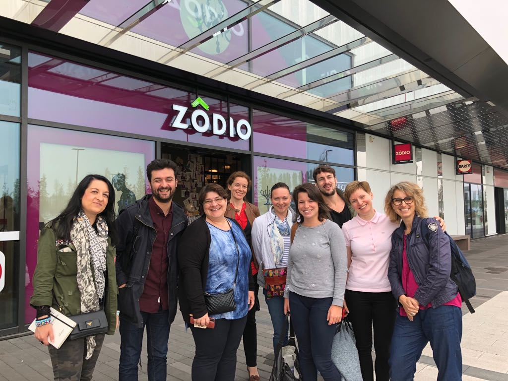
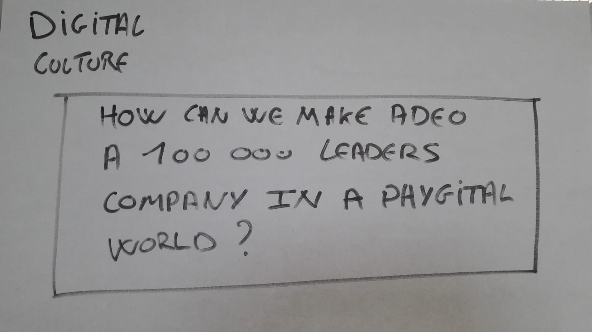
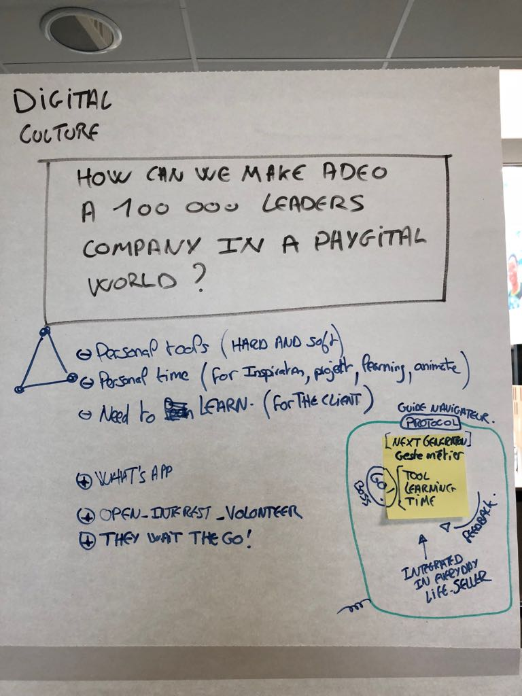
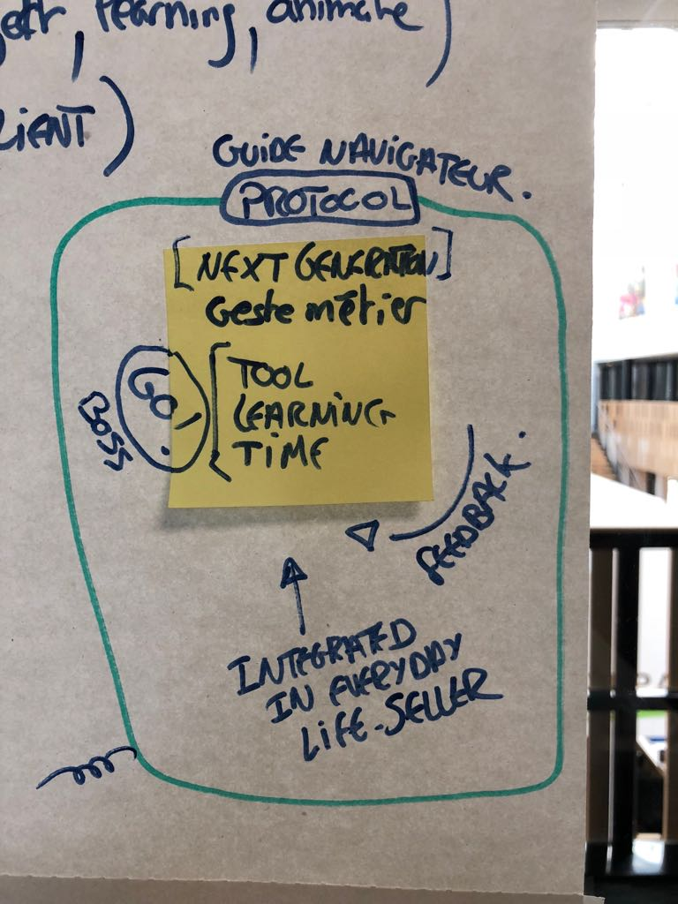

# Day 5 - Tester et apprendre

### Plan de la journée

* Brief de la journée "in store"
* interviews en contexte
* regroupement des feedbacks par projets
* Détection des patterns par projets
* Triangulation des patterns
* Détection des patterns globaux
* Synthèse des apprentissages
* Debrief du sprint et ouverture sur la suite

### Déroulé de la journée

8h30, l'équipe se réunit. Nous allons directement tous ensemble dans le premier store Leroy Merlin où nous devons retrouver nos premiers testeurs. Le défi de cette matinée : trouver 5 testeurs pour chacun des 3 groupes, gérer les interviews et regrouper les feedbacks pour l'après-midi.

Chaque équipe a son script d'interview avec la répartition des rôles, le facilitateur restant en soutien pour les 3 groupes. Nous avons le temps de gérer 2 Magasins, un Loroy Merlin et un store Zodio sur la suite de notre parcours. Il était très important d'avoir au moins 2 stores bien différents pour une remonter de patterns pertinente par la diversité. Le point de vue des membres de l'équipe de Russie, Brézil et Italie était très important ; en effet, il fallait s'assurer des points de ressemblance entre les différents pays, que la culture française n'est pas isolée pour que notre travail soit utile de manière globale.

Durant cette matinée, nous réussissons suffisement d'entretiens pour notre regroupement de l'après-midi. Il n'est jamais aussi comfortable de gérer des interviews directement sur un lieu de travail, cependant, l'avantage est d'être en contexte, avec des personnes dans l'état d'esprit adéquate.

Après un bon repas, l'équipe du sprint se regroupe dans une nouvelle salle pour installer 3 boards, pour chacun des 3 projets. Dessus, chaque équipe projet regroupe les feedbacks notés sur des post-it suivant plusieurs critères. Classement par testeur, suivant 3 Colonnes : Retours positifs, neutres et négatifs.

Chaque équipe prend le temps ensuite d'affiner les retours, détecter les doublons pour chaque testeur. Ensuite, utilisant des gommettes de couleurs, détecter les similitudes entre les retours de chacun des testeurs. Cela fait émerger les patterns de chaque projet, à noter de côté.

Phase suivante, découvrir les projets des autres équipes et "sentir" les similitudes entre les patterns de chaque projet. Durant cette phase, il est important de détecter par l'analyse logique mais aussi par l'intuition !

Avant dernière phase. C'est le moment pour toute l'équipe du sprint de se réunir et de mettre en commun ses détections de patterns pour chacun de leurs projets. Ensuite, au cours d'une dernière discussion commune, faire émerger les gros patterns communs, les big ideas !

### La magie opère

C'est souvent une phase complexe du sprint. Reprenant notre challenge initial, il convient de détecter si nous sommes partie dans le bon sens ou pas du tout. Il convient de découvrir aussi si les analyses et les ressentis de chacun des participants sont alignés ou divergeant. Beaucoup de paramètres donc à prendre en compte, en plus de la fatigue !

Ce sprint cependant voir émerger la magie qui souvent donne toute la pertinence à ces 5 jours passés ! Durant cette dernière discussion ouverte, pas de débat particulier, chacun apporte ses détections de patterns, sur lesquels les autres membres rebondissent de manière constructive. Je regroupe les informations sur une dernière board pour construire "un modèle" synthèse de tout le sprint. Les membres convergent naturellement, chacun apportant une touche complémentaire validée par les autres. À ce moment exact, l'intelligence collective prend tout son sens : ce n'est plus 9 cerveaux séparés qui collaborent, c'est un méta-cerveaux ou chaque membre se connecte comme de neurones. Les retours se précisent et prennent leur forme finale ; **Une nouvelle forme commune**.

**C'est très impressionnant de voir comme chacun se détache très rapidement de la forme de son propre projet de la veille pour rejoindre ensemble un projet commun.** C'est ici toute l'importance et la puissance du sprint : apprendre en groupe, s'aligner sur un langage commun en 5 jours, préparer la base pour la suite, d'une seule voix, résonnant pour tous !

### Un modèle, un protocole pour développer la "culture digitale"

**Challenge initial de notre sprint : How can we make Adeo a 100 000 leaders company in a phygital world ?**

Ce que nos recherches ont détecté : 

* Les collaborateurs sont prêts et motivés pour réinventer leur manière de travailler au quotidien.
* Cependant, ils doivent actuellement utiliser leurs outils numériques personnels
* Ils doivent également monter en compétence et acter pour leur développement sur leur temps personnel.
* Ils ont besoin d'apprendre, d'être formés. Ils sont en attente, en demande.

Également, ils cherchent déjà à se connecter les uns avec les autres, que ce soit dans le même store, mais aussi entre les stores. Cependant, ils le font actuellement "comme ils peuvent". Sur leur temps perso et avec des outils dont ils ont l'habitude, comme WHATSAPP, qui remonte comme outil principal de discussion entre collaborateurs.

**Ils souhaitent utiliser la majeur partie de leur temps POUR leurs clients** : les accompagner dans leurs projets, les conseiller, leur trouver des ressources, des inspirations. Fluidifier grâce à leur expertise et leur sensibilité les projets de chaque "inhabitant". Ils ont besoin de temps pour faire ce travail, se libérer d'autres tâches comme la mise en rayon, les inventaires, la logistique, etc... Ils mettent clairement une priorité sur la relation client par une posture de facilitateur de projet, de conseillé, de partenaire.

**Ils sont volontaires**. Ce qui bloque actuellement leur expression, c'est qu'ils n'ont pas un "GO" clair de leurs managers, de la direction. Ils agissent actuellement pour se développer et développer l'activité de l'entreprise sur initiative et temps personnel. Ils n'ont pas encore le sentiment que cela pourrait être "inclus" dans leurs "gestes métier".

En clair, les collaborateurs sont prêts à réinventer par eux-même leur manière de travailler et de vivre leur temps ADEO. Cependant, ils sont limités par un manque de connaissance, de formation, un manque d'outils et un manque de temps.

### Le guide navigateur

C'est la base donnée à tous les collaborateurs pour qu'ils aient la connaissance et les ressources à leur métier, leurs "gestes métier". Ce guide est un protocole, reposant sur une manière de travailler dans la culture "actuelle" et historique de Adeo. S'il convient de renouveler la culture de Adeo grâce à l'inspiration de la culture digitale, alors c'est ce guide métier qu'il faut réviser !

#### Une nouvelle génération de gestes métier

Il est temps pour Adeo de réviser les gestes métier. Un collaborateur _in store_ n'est plus simplement un vendeur de matériel : c'est un conseillé et un partenaire de projet, qu'il construit en collaboration complète avec le porteur de projet qu'est le client.

#### Le GO

Les collaborateurs sont volontaires mais ils sont freinés dans leur dynamique par le fait qu'ils "ne savent pas jusqu'où ils peuvent aller", mais aussi par le fait qu'ils doivent s'exprimer en dehors de leurs heures de travail.

Un "GO" du manager _in store_ marquerait le lancement de la nouvelle dynamique, de la nouvelle génération de "gestes métier". Ce "GO" est annoncé avec les éléments de ce nouveau guide navigateur : 

* les outils numériques nécessaire \(ne plus utiliser son smartphone perso, les apps basiques utiles...\), 
* les ressources et évènements d'apprentissages \(monter en compétence, fluidifier l'évolution, etc...\)
* Le temps \(intégrer les démarches venant de la culture digitale dans le temps de travail pour ne pas "surcharger" et même améliorer les conditions de travail\)

#### Le feedback

Un élément du protocole est la récupération des feedbacks collaborateurs, en contexte. Pendant qu'ils sont en train de faire évoluer leur gestes métier et leur culture, ils font remonter ce qui se fluidifie et là où il y a des résistances. Ce sont les collaborateurs _in store_  qui se réinventent eux-même, dans le cadre de leur magasin, mais c'est aussi leurs feedbacks qui permettent au cercle stratégique de faire évoluer le protocole principal mais aussi de nourrir les protocoles locaux des autres magasins.

#### Protocole en développement \(local\) &gt; Feedback \(commun\) &gt; évolution du protocole source \(nouvelle version - commun et global\) &gt; Eléments utiles pour faire évoluer les protocoles d'autres stores \(local\)

### En synthèse

À partir du "GO" qui est accompagné du contenu du nouveau guide navigateur, les collaborateurs pourront se mettre en mouvement pour faire évoluer leurs gestes métier, réinventer eux-même leur posture, en rapport avec leur culture locale. En action, ils remontent des feedbacks permettant de faire évoluer leur protocole local, tout en nourrissant un cercle stratégique qui fera évoluer une source de protocole commun. "Cette source" globale en se déployant localement suivant les identités propre de chaque terrain, créé une évolution de la culture Adeo, qui s'imprègne des éléments de la culture digitale : l'interdépendance, le test and learn, le collaboratif, la valorisation de la diversité, etc...\(voir précédemment les éléments de la "culture digitale"\).

### Point de vue Hugo 

Le jour 5 est la journée de test. Les membres des sous-équipes se divisent le travail pour mener à bien les tests : une personne mène l’entretien avec le testeur, l’autre prend des notes concernant les réponses et la troisième personne se concentre sur le langage non-verbal du testeur.

Les sous-équipes ont passé la matinée dans deux enseignes du groupe. Deux enseignes très différentes avec des profils de collaborateurs très variés afin de mieux saisir les différences qui existent au global dans le groupe.

Les entretiens ont duré en moyenne entre 20 et 30 minutes. Les collaborateurs étaient motivés par l’exercice et assez à l’aise pour partager leur quotidien. Les prototypes semblaient fonctionner et les retours étaient plutôt positifs.

Afin de confirmer ces ressenties, l’équipe projet a ensuite procédé à une triangulation : chaque sous-équipe a placé les réponses de ses testeurs sur un mur en prenant soin de différencier les testeurs, les réponses négatives - neutres - positives. Ensuite chaque sous-équipe a été invité à détecter les modèles qui revenaient dans les réponses des testeurs. Chaque sous-équipe a ainsi dégager des tendances autour de son projet grâce aux tests.

Dans un second temps, c’est l’ensemble de l’équipe projet qui a du trouver les tendances qui émergeaient de l’ensemble des réponses des testeurs sur les 3 différents projets et prototypes \(les basiques de l’infrastructure digitale, le centre de ressources et de connaissances, le challenge des olympiades\). 

**Cette triangulation nous a permis de faire ressortir les éléments clés et les besoins des collaborateurs.**

À la fin de la journée, grâce à un travail de synthèse, de définition et de rapprochement et avec l’aide du facilitateur, chaque membre de l’équipe projet s’est aligné sur une modèle théorique répondant à la question du sprint : comment stimuler le leadership des 100 000 collaborateurs à l’ère du digital ?

* **Mettre en place les basiques de l’infrastructure digitale**
* **Développer l'apprentissage par le concret et le partage des connaissances**
* **Libérer du temps pour des initiatives et l’innovation par la base**

Chaque membre de l'équipe projet a ensuite partagé son enthousiasme et son impatience concernant la mise en place de ce modèle théorique. Les porteurs de projet vont devoir maintenant affiner ce modèle et le présenter à la direction du groupe afin d’acquérir les budgets nécessaires pour lancer les projets et déployer les actions à travers le groupe.

Cette semaine de sprint a été riche en enseignements concernant la culture numérique, le changement de paradigme de notre société et les problématiques des organisations. C'était également une expérience humaine et multiculturelle forte.   

### Point de vue de Fanny

Le dernier jour est sans doute le plus intense. A la fatigue et au stress de la semaine s’ajoute une organisation quasi-militaire afin d’aller « tester pour de vrai » les prototypes et les guides d’animation imaginés la veille.

C’est en équipe \(10 individus\) et à trois voitures que nous nous rendons dans deux magasins différents \(Leroy Merlin et Zodio\) afin de réaliser des entretiens semi-directifs et tests d’usage à des collaborateurs sur leur lieux de travail.

Les enjeux sont multiples : récolter de la donnée qualitative afin de mieux appréhender les prototypes, réussir à convaincre des collaborateurs de nous accorder 30 minutes de leur temps, tenir le timing pour la réalisation des entretiens afin de ne pas perturber la vie du magasin, parvenir à réaliser un nombre suffisant d’entretiens \(initialement 15 : 5 entretiens par groupe\).

5 entretiens ont été réalisés dans le premier point de vente et à peu près pareil dans le second. Alors que dans le premier il semblait dur de « capter » des collaborateurs disponibles pour nous répondre, dans le second, ils semblaient beaucoup plus enclins à nous répondre ; malgré un rappel à l’ordre de certains collaborateurs qui avaient quitté leur poste sans prévenir pour répondre aux sollicitations des membres du projet.

**Cette phase immersive est sans doute la plus importante des 5 jours :** Elle permet à la fois de confronter les idées et les projets de manière très agile au terrain, mais elle permet surtout de confronter les collaborateurs à la réalité du terrain en magasin et de comprendre comment les « vendeurs » interagissent et se positionnent sur la culture du digital dans leur quotidien.

Le protocole proposé par le facilitateur a permis d’organiser les rôles de chaque membre des équipes : une personne qui mène l’entretien et les autres qui observent et qui prennent des notes. Les notes sont prises sur des « post-it ». Une idée par « post-it », puis un classement des « post-it » par typologie d’idées : positive, neutre et négative.

A la suite de cette immersion, l’étape de la triangulation a permis d’identifier des typologies transversales à l’ensemble des projets. Chaque groupe devait trier ses « post-it » en fonction des personnes interviewées et des typologies d’idées. Ensuite, suivant un code couleur, chaque équipe devait identifier les items qui revenaient dans chaque entretien afin d’identifier les différentes catégories sous jacentes au discours. **Cette approche de la triangulation réalisée de la sorte permet de réinventer les grilles d’analyse thématique et du tri du semi-brut si cher aux sociologues.**

Une fois que chaque groupe a identifié ses catégories, ils devaient trouver dans les autres groupes des catégories similaires afin d’identifier les catégories transversales aux trois groupes et donc à tous les entretiens réalisés.

**D’un point de vue scientifique ces catégories représentent des concepts. L’assemblage de ces concepts devient ce que l’on appelle un « objet théorique » qui va nous permettre de créer un modèle abstrait de la réalité et ici de la stratégie à adopter pour amorcer la « culture digitale » chez ADEO.**

Pour passer le cap de ces catégories à ce modèle théorique, le facilitateur officie tel un chef d’orchestre des idées, des intuitions et des convictions de chacun. Ainsi, un modèle qui parvient à faire consensus émerge très rapidement grâce à tout le travail créatif et de co-construction réalisé depuis le début de la semaine.

Il semble que le processus créatif amorcé depuis le début de l’expérience produise un terrain fertile qui permet d’une part de faire germer des idées pertinentes mais également de les consolider rapidement, afin de n’avoir pas seulement une vision resserrée de la réalité, mais une compréhension à la fois locale et globale des enjeux et des problématiques de la « culture digitale ».

